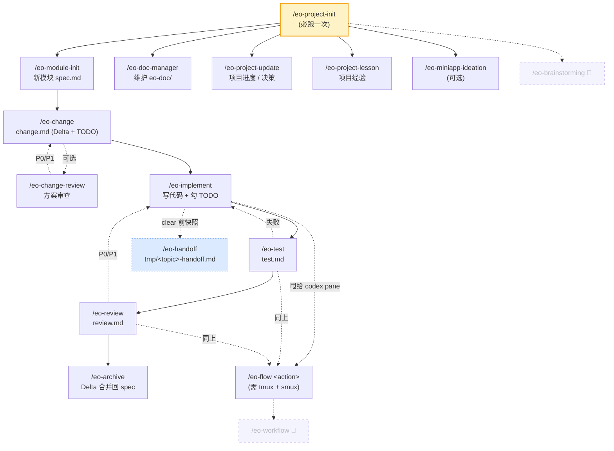

# eo-skills

一套面向 **Claude Code / Codex** 的开发工作流 skill 集合。围绕"模块活文档 + change Delta"机制，把从模块设计、方案、实施、测试、审查到归档的全流程拆成可独立调用的 skill，并支持跨 agent（Claude ↔ Codex）协作。

> 想直接看每个 skill 的详细用法、典型流程、设计权衡？请看 [docs/GUIDE.md](docs/GUIDE.md)。

---

## 依赖

| 依赖 | 用途 | 安装 |
|------|------|------|
| [Claude Code](https://docs.claude.com/en/docs/claude-code/overview) | skill 运行时 | 官方 CLI |
| `tmux` | 跨 agent 协作底座（`eo-flow` 必需） | `brew install tmux` |
| [smux](https://github.com/ShawnPana/smux) | tmux pane 间通信桥（`tmux-bridge`） | 见上游仓库 README |

> `eo-flow` 依赖 smux 提供的 `tmux-bridge` CLI 与另一 pane 里的 codex agent 通信。如果你只用单 agent 流（不跨 pane handoff），可以不装 tmux/smux。

---

## 安装

```bash
# 1. clone 本仓库到任意位置
git clone https://github.com/SimpleEve/eo-skills.git ~/code/eo-skills

# 2a. 软链到 Claude Code skill 目录
mkdir -p ~/.claude/skills
for d in ~/code/eo-skills/eo-*; do
  ln -sfn "$d" ~/.claude/skills/$(basename "$d")
done

# 2b. 软链到 Codex skill 目录（如果你也用 codex，eo-flow 跨 agent 必装）
mkdir -p ~/.agents/skills
for d in ~/code/eo-skills/eo-*; do
  ln -sfn "$d" ~/.agents/skills/$(basename "$d")
done
```

软链而非复制：本仓库更新后所有 skill 立刻生效。

> **关于 `eo-flow` 的对端 agent**：当前实现**写死调用 codex**（在另一个 tmux pane 里跑 codex CLI）。如果你想换成 Claude Code 作为对端，需要自行改 `eo-flow/SKILL.md` 里的派发指令。

---

## 第一次使用

进入任意项目目录，在 Claude Code 里跑：

```
/eo-project-init
```

它会生成 `.eo-project.json`（项目级配置）+ 双侧最小骨架（代码侧 `eo-doc/` + 项目管理侧）。**所有其它 eo-* skill 都依赖它**，没跑过会直接报错。

---

## 流程一图流



> 🚧 = 实验中，未稳定，**暂不推荐使用**。`eo-brainstorming` 与 `eo-workflow` 仍在调试，正式分发前请勿依赖。
>
> `/eo-handoff` 横切整个流程：clear 前在**任意节点**都可触发，把当前状态写到 `tmp/<topic>-handoff.md` 供下个会话载入。图中仅以 implement 阶段示意。

---

## 我该用哪个？

| 场景 | 用 | 备注 |
|------|---|------|
| 第一次在项目里用 eo-skills | `/eo-project-init` | **必跑** |
| 新建一个模块 | `/eo-module-init` | 自带一次性 spec-review |
| 已有模块发起业务变更 | `/eo-change` | 产出 `change.md` |
| 按 change 写代码 | `/eo-implement` | 含 bug 修复循环 |
| 跑测试 / 写测试报告 | `/eo-test` | — |
| 实施后代码审查 | `/eo-review` | 强制，每个 change 都要 |
| 审查通过后归档 | `/eo-archive` | Delta 自动合回 spec |
| 把一步甩给另一个 pane 的 codex | `/eo-flow <action>` | 需 tmux + smux |
| 即将 `/clear` 但要保留进度 | `/eo-handoff` | 写到 `tmp/<topic>-handoff.md`，下个会话载入即续 |
| 维护 `eo-doc/` 文档体系 | `/eo-doc-manager` | sync / re-sync |
| 项目进度 / 决策 / 经验 | `/eo-project-update` `/eo-project-lesson` | 项目管理侧 |
| 微信小程序构思 | `/eo-miniapp-ideation` | 可选 |

不在表里的 skill（`eo-spec` / `eo-spec-review` / `eo-change-review`）是被上面这些 skill 内部触发或作为可选增强，详见 [GUIDE](docs/GUIDE.md)。

---

## 三种 review 别混用

| Skill | 审什么 | 核心问题 | 强制？ |
|-------|-------|---------|-------|
| `/eo-spec-review` | 模块 `spec.md` | **需求**对吗？业务自洽？ | module-init 时强制 |
| `/eo-change-review` | 某个 change 的方案 | **方案**对吗？Delta 合理？ | 可选（高风险建议走） |
| `/eo-review` | change 实施后的代码 | **代码**对吗？符合 AC？ | 每个 change 强制 |

详细边界见 [GUIDE](docs/GUIDE.md#三种-review-的边界)。

---

## License

[MIT](LICENSE)
