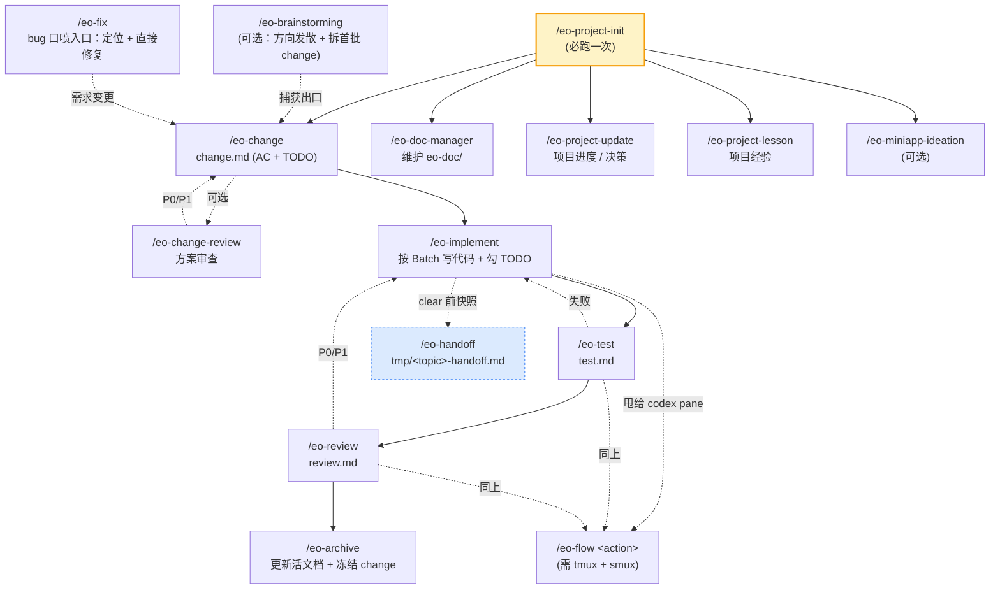

# eo-skills

一套面向 **Claude Code / Codex** 的开发工作流 skill 集合。围绕"change 工件 + 活文档（state / agent-handbook）"机制，把从构思、变更、实施、测试、审查到归档的全流程拆成可独立调用的 skill，并支持跨 agent（Claude ↔ Codex）协作。

> ⚠️ **v2 重构进行中**：本分支正在按 [docs/v2-design.md](docs/v2-design.md) 改造（spec 归为 change、归档不再反写 spec、验收驱动、粒度硬指标等）。部分 skill 内容仍是 v1 口径，以设计稿为准。

> 想直接看每个 skill 的详细用法、典型流程、设计权衡？请看 [docs/GUIDE.md](docs/GUIDE.md)。

---

## 依赖

| 依赖 | 用途 | 安装 |
|------|------|------|
| [Claude Code](https://docs.claude.com/en/docs/claude-code/overview) | skill 运行时 | 官方 CLI |
| [Antigravity](https://antigravity.dev) | skill 运行时（可选） | 官方 CLI |
| `tmux` | 跨 agent 协作底座（`eo-flow` 必需） | `brew install tmux` |
| [smux](https://github.com/ShawnPana/smux) | tmux pane 间通信桥（`tmux-bridge`） | 见上游仓库 README |

> `eo-flow` 依赖 smux 提供的 `tmux-bridge` CLI 与另一 pane 里的 codex agent 通信。如果你只用单 agent 流（不跨 pane handoff），可以不装 tmux/smux。

---

## 安装

macOS / Linux:

```bash
# 方式一：远程安装（自动 clone/update 到 ~/.eo-skills/repo）
curl -fsSL https://raw.githubusercontent.com/SimpleEve/eo-skills/main/install.sh | sh

# 方式二：clone 后安装
# 1. clone 本仓库到任意位置
git clone https://github.com/SimpleEve/eo-skills.git ~/code/eo-skills

# 2. 执行安装脚本（默认同时安装到 Claude Code + Codex + Antigravity）
cd ~/code/eo-skills
sh install.sh
```

脚本会把仓库中所有 `eo-*` 目录**直接软链**到各 agent 的 skills 目录，无中间层：

| Agent | 目标目录 |
|-------|----------|
| Claude Code | `~/.claude/skills/` |
| Codex | `~/.agents/skills/` |
| Antigravity | `~/.gemini/antigravity/skills/` |

如果你只想装某一侧：

```bash
sh install.sh --claude-only
sh install.sh --codex-only
sh install.sh --antigravity-only
```

Windows:

```bat
REM 1. clone 本仓库到任意位置
git clone https://github.com/SimpleEve/eo-skills.git %USERPROFILE%\code\eo-skills

REM 2. 执行安装脚本（默认同时安装到 Claude Code + Codex + Antigravity）
cd /d %USERPROFILE%\code\eo-skills
install.bat
```

如果你只想装某一侧：

```bat
install.bat --claude-only
install.bat --codex-only
install.bat --antigravity-only
```

脚本会把当前仓库下所有 `eo-*` 目录逐个链接到对应的 skill 目录；如果目标里已经有同名 skill，会直接跳过，不会覆盖。链接而非复制：本仓库更新后所有 skill 立刻生效。

> **关于 `eo-flow` 的对端 agent**：当前实现**写死调用 codex**（在另一个 tmux pane 里跑 codex CLI）。如果你想换成 Claude Code 作为对端，需要自行改 `eo-flow/SKILL.md` 里的派发指令。

---

## 第一次使用

进入任意项目目录，在 Claude Code 里跑：

```
/eo-project-init
```

它会生成 `.eo-project.json`（项目级配置）+ 双侧最小骨架（代码侧 `eo-doc/` + 项目管理侧）。**所有其它 eo-* skill 都依赖它**，没跑过会直接报错。

---

## 流程一图流


```mermaid
flowchart TD
    Init["/eo-project-init<br/>(必跑一次)"]:::entry --> Change
    Brain["/eo-brainstorming<br/>(可选：方向发散 + 拆首批 change)"] -.捕获出口.-> Change["/eo-change<br/>change.md (AC + TODO)"]
    Change -.可选.-> CR["/eo-change-review<br/>方案审查"]
    CR -.P0/P1.-> Change
    Change --> Imp["/eo-implement<br/>按 Batch 写代码 + 勾 TODO"]
    Imp --> Test["/eo-test<br/>test.md"]
    Test -.失败.-> Imp
    Test --> Rev["/eo-review<br/>review.md"]
    Rev -.P0/P1.-> Imp
    Rev --> Arch["/eo-archive<br/>更新活文档 + 冻结 change"]

    Fix["/eo-fix<br/>bug 口喷入口：定位 + 直接修复"] -.需求变更.-> Change

    Imp -.甩给 codex pane.-> Flow["/eo-flow &lt;action&gt;<br/>(需 tmux + smux)"]
    Test -.同上.-> Flow
    Rev -.同上.-> Flow

    Init --> Doc["/eo-doc-manager<br/>维护 eo-doc/"]
    Init --> PU["/eo-project-update<br/>项目进度 / 决策"]
    Init --> PL["/eo-project-lesson<br/>项目经验"]
    Init --> Mini["/eo-miniapp-ideation<br/>(可选)"]

    Imp -.clear 前快照.-> Hand["/eo-handoff<br/>tmp/&lt;topic&gt;-handoff.md"]:::cross

    classDef entry fill:#fef3c7,stroke:#f59e0b,stroke-width:2px
    classDef cross fill:#dbeafe,stroke:#3b82f6,stroke-dasharray: 3 3
```

> `/eo-handoff` 横切整个流程：clear 前在**任意节点**都可触发，把当前状态写到 `tmp/<topic>-handoff.md` 供下个会话载入。图中仅以 implement 阶段示意。
>
> 样式微调、多语言这类 trivial 改动走**直改模式**（不开 change，判据见 [eo-shared/granularity.md](eo-shared/granularity.md)），由 doc-manager 的 cursor sync 兜底归档。

---

## 我该用哪个？

| 场景 | 用 | 备注 |
|------|---|------|
| 第一次在项目里用 eo-skills | `/eo-project-init` | **必跑** |
| 想法还不成形 / 新项目从零起步 | `/eo-brainstorming` | 发散 + 钉决策，出口直接拆首批 change |
| 发起变更（新功能 / 增强 / 重构） | `/eo-change` | 产出 `change.md`（AC 前置 + TODO 分批）；trivial 会主动短路成直改 |
| 按 change 写代码 | `/eo-implement` | 按 Batch 执行，含 bug 修复循环 |
| 发现 bug（口喷即可） | `/eo-fix` | 定位 + 直接修复；难缠 bug 自动升级深挖模式；需求变更转 change |
| 跑测试 / 写测试报告 | `/eo-test` | 以 AC 为锚 |
| 实施后代码审查 | `/eo-review` | 强制，每个 change 都要 |
| 审查通过后归档 | `/eo-archive` | 更新 state/handbook + 冻结 change（不反写 spec） |
| 把一步甩给另一个 pane 的 codex | `/eo-flow <action>` | 需 tmux + smux |
| 定设计系统 / 出视觉方案 / 高保真页面 | `/eo-design <mode>` | init / variants / apply / audit，真相源 `DESIGN.md` |
| 即将 `/clear` 但要保留进度 | `/eo-handoff` | 写到 `tmp/<topic>-handoff.md`，下个会话载入即续 |
| 维护 `eo-doc/` 文档体系 | `/eo-doc-manager` | sync / re-sync |
| 项目进度 / 决策 / 经验 | `/eo-project-update` `/eo-project-lesson` | 项目管理侧 |
| 加一条 backlog 待办 / 灵感 | `/eo-backlog` | 仅追加到 `backlog.md` |
| 微信小程序构思 | `/eo-miniapp-ideation` | 可选 |

不在表里的 skill（`eo-change-review`）是可选增强，详见 [GUIDE](docs/GUIDE.md)。

---

## 两种 review 别混用

| Skill | 审什么 | 核心问题 | 强制？ |
|-------|-------|---------|-------|
| `/eo-change-review` | 某个 change 的方案 | **方案**对吗？AC 质量、粒度合规？ | 可选（高风险建议走） |
| `/eo-review` | change 实施后的代码 | **代码**对吗？符合 AC？ | 每个 change 强制 |

---

## License

[MIT](LICENSE)
