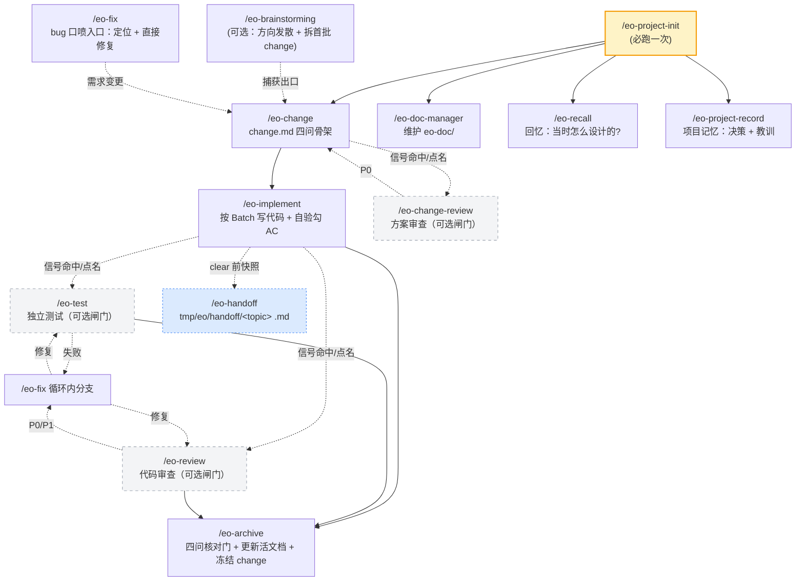

# eo-skills

一套面向 **Claude Code / Codex** 的开发工作流 skill 集合。以 change 工件为核心，配套可选的 codegraph 代码召回与 agent-handbook 项目操作手册，把从构思、变更、实施、测试、审查到归档的全流程拆成可独立调用的 skill，并支持跨 agent（Claude ↔ Codex）协作。

> 从 v1 升级？破坏性变更与迁移步骤见 [docs/migration-v1-to-v2.md](docs/migration-v1-to-v2.md)。

> 想直接看每个 skill 的详细用法、典型流程、设计权衡？请看 [docs/GUIDE.md](docs/GUIDE.md)。

> 担心流程的 token 开销？实测数据与 gstack / Anthropic 官方对标见 [docs/token-budget-benchmark.md](docs/token-budget-benchmark.md)。

---

## 依赖

| 运行时 | 必需性 | 安装 |
|--------|--------|------|
| [Claude Code](https://docs.claude.com/en/docs/claude-code/overview) | 必需（skill 运行时） | 官方 CLI |
| [Codex](https://github.com/openai/codex) | 可选（skill 运行时） | 官方 CLI |
| [Antigravity](https://antigravity.dev) | 可选（skill 运行时） | 官方 CLI |

终端 CLI（`eo-helper` / `eo-board` / `eo-sync`）只用 Python 3 标准库，零第三方依赖（macOS / Linux 自带 python3 即可）。


---

## 安装

macOS / Linux:

```bash
# 方式一：远程安装（自动 clone/update 到 ~/.eo-skills/repo）
curl -fsSL https://raw.githubusercontent.com/SimpleEve/eo-skills/main/install.sh | sh

# 方式二：clone 后安装
# 1. clone 本仓库到任意位置
git clone https://github.com/SimpleEve/eo-skills.git ~/code/eo-skills

# 2. 执行安装脚本（默认同时安装到 Claude Code + Codex + Antigravity）
cd ~/code/eo-skills
sh install.sh
```

脚本会把仓库中所有 `eo-*` 目录（各 skill + `eo-shared` 支持目录）**直接软链**到各 agent 的 skills 目录，无中间层。**必须整套安装**——单独拷贝某个 skill 目录会使其对 `../eo-shared/` 的引用断链：

| Agent | 目标目录 |
|-------|----------|
| Claude Code | `~/.claude/skills/` |
| Codex | `~/.agents/skills/` |
| Antigravity | `~/.gemini/antigravity/skills/` |

如果你只想装某一侧：

```bash
sh install.sh --claude-only
sh install.sh --codex-only
sh install.sh --antigravity-only
```

Windows:

```bat
REM 1. clone 本仓库到任意位置
git clone https://github.com/SimpleEve/eo-skills.git %USERPROFILE%\code\eo-skills

REM 2. 执行安装脚本（默认同时安装到 Claude Code + Codex + Antigravity）
cd /d %USERPROFILE%\code\eo-skills
install.bat
```

如果你只想装某一侧：

```bat
install.bat --claude-only
install.bat --codex-only
install.bat --antigravity-only
```

脚本会把当前仓库下所有 `eo-*` 目录逐个链接到对应的 skill 目录；如果目标里已经有同名 skill，会直接跳过，不会覆盖。链接而非复制：本仓库更新后所有 skill 立刻生效。


---

## 第一次使用

> 心智模型一句话：**对话里干活（skill），终端里看板（CLI）**。skill 在 Claude Code / Codex 会话里喊；终端侧日常只需记一条命令——`eo-helper`（数字菜单直达看板与同步各入口），`install.sh` 已链接进 `~/.local/bin`（POSIX-only，Windows 用 WSL）。

进入任意项目目录，在 Claude Code 里跑：

```
/eo-project-init
```

它会生成 `.eo-project.json`（项目级配置）+ 双侧最小骨架（代码侧 `eo-doc/` + 项目管理侧）。**所有其它 eo-* skill 都依赖它**，没跑过会直接报错。

项目管理侧（roadmap / backlog / 决策 / 教训）放仓库内 `.eo-project/`，随仓库提交——协作者 clone 即得完整项目记忆。init 成功还会顺手把项目登记进 `~/.eo/projects.json`（多项目看板靠它；失败不阻塞，稍后用 `eo-helper` 菜单「注册本项目」补上）。

协作场景：`.eo-project.json` 提交进仓库承载团队共享字段；机器相关字段（`project_root` / `mode` 等）放进不提交的 `.eo-project.local.json` 做顶层字段覆盖（协作者 clone 后重跑 `/eo-project-init` 自动引导生成）。

---

## 流程一图流


```mermaid
flowchart TD
    Init["/eo-project-init<br/>(必跑一次)"]:::entry --> Change
    Brain["/eo-brainstorming<br/>(可选：方向发散 + 拆首批 change)"] -.捕获出口.-> Change["/eo-change<br/>change.md 四问骨架"]
    Change --> Imp["/eo-implement<br/>按 Batch 写代码 + 自验勾 AC"]
    Imp --> Arch["/eo-archive<br/>四问核对门 + 更新活文档 + 冻结 change"]

    Change -.信号命中/点名.-> CR["/eo-change-review<br/>方案审查（可选闸门）"]:::gate
    CR -.P0.-> Change
    Imp -.信号命中/点名.-> Test["/eo-test<br/>独立测试（可选闸门）"]:::gate
    Imp -.信号命中/点名.-> Rev["/eo-review<br/>代码审查（可选闸门）"]:::gate
    Test -.失败.-> Fix2["/eo-fix 循环内分支"] -.修复.-> Test
    Rev -.P0/P1.-> Fix2 -.修复.-> Rev
    Test --> Arch
    Rev --> Arch

    Fix["/eo-fix<br/>bug 口喷入口：定位 + 直接修复"] -.需求变更.-> Change


    Init --> Doc["/eo-doc-manager<br/>维护 eo-doc/"]
    Init --> Rec["/eo-recall<br/>回忆：当时怎么设计的?"]
    Init --> PRec["/eo-project-record<br/>项目记忆：决策 + 教训"]

    Imp -.clear 前快照.-> Hand["/eo-handoff<br/>tmp/eo/handoff/&lt;topic&gt; .md"]:::cross

    classDef entry fill:#fef3c7,stroke:#f59e0b,stroke-width:2px
    classDef cross fill:#dbeafe,stroke:#3b82f6,stroke-dasharray: 3 3
    classDef gate fill:#f3f4f6,stroke:#9ca3af,stroke-dasharray: 5 5
```

> `/eo-handoff` 横切整个流程：clear 前在**任意节点**都可触发，把当前状态写到 `tmp/eo/handoff/<topic>.md` 供下个会话载入。图中仅以 implement 阶段示意。
>
> v3 默认主路只有三站：**change → implement → archive**；change-review / test / review 是**可选闸门**——风险信号命中（不可逆操作 / 权限资金 / 外部契约 / 大影响面）或你点名时才挂，豁免一个词的事。样式微调、多语言这类 trivial 改动走**直改模式**（不开 change，判据见 [eo-shared/granularity.md](eo-shared/granularity.md)），改完常规 commit 即结算。
>
> **互不干扰的工作可并行**：Batch 可标同层并行组（`Batch 2a`/`2b`）——由 `/eo-loop` 派发到隔离 worktree 并行推进；超标拆出的 change 序列标「依赖 #N」，按依赖序串行推进（判据、机械校验与合流 checkpoint 见 [eo-shared/granularity.md](eo-shared/granularity.md) §6）。

---

## 我该用哪个？

| 场景 | 用 | 备注 |
|------|---|------|
| 第一次在项目里用 eo-skills | `/eo-project-init` | **必跑** |
| 想法还不成形 / 新项目从零起步 | `/eo-brainstorming` | 发散 + 钉决策，出口直接拆首批 change |
| 发起变更（新功能 / 增强 / 重构） | `/eo-change` | 产出四问骨架 `change.md`（解决什么问题 / 完成后看到什么 / 谁验收 / 不通过怎么办）；trivial 短路直改 |
| 按 change 写代码 | `/eo-implement` | 按 Batch 执行，批末自验勾 AC；测试随写（普通工程实践） |
| 发现 bug（口喷即可） | `/eo-fix` | 定位 + 直接修复；难缠 bug 自动升级深挖模式；需求变更转 change |
| 独立测试 / 补测试 | `/eo-test` | **可选闸门**：信号命中或点名时用；独立视角审计 + 补缺，产简版 test.md |
| 实施后代码审查 | `/eo-review` | **可选闸门**：信号命中或点名时用；通过则 status 置 reviewed |
| 验收归档 | `/eo-archive` | 四问核对硬门 + 冻结 change |
| 忘了当初怎么设计的 / 想看某段逻辑的实现 | `/eo-recall` | 只读问答，分层作答带出处；复杂逻辑可出图/解释页 |
| 定设计系统 / 出视觉方案 / 高保真页面 | `/eo-design <mode>` | init / variants / apply / audit，真相源 `DESIGN.md` |
| 即将 `/clear` 但要保留进度 | `/eo-handoff` | 写到 `tmp/eo/handoff/<topic>.md`，下个会话载入即续 |
| 维护 `eo-doc/` 文档体系 | `/eo-doc-manager` | changes/INDEX + agent-handbook + templates/ 维护 |
| 记录决策 / 经验教训 | `/eo-project-record` | lessons/ + decisions/，带 INDEX 供自动消费 |
| 加一条 backlog 待办 / 灵感 | `/eo-backlog` | 仅追加到 `backlog.md` |
| 把若干节点串起来循环推进到收敛 | `/eo-loop` | 总控调度：圈线段 → 派发到可插拔基底（子 agent / codex / orca）→ 每 ≤10min 主动观测并出进度报告；互不干扰的并行组多 worker 并行推进 |

不在表里的 skill（`eo-change-review`）是可选闸门之一（方案审查，implement 之前），详见 [GUIDE](docs/GUIDE.md)。

---

## 看板与同步

日常只需记一条命令：

```bash
eo-helper
```

数字菜单覆盖全部高频动作——全局实时看板、注册项目、同步看板卡片、看板自动跟手、全局终端速览。每次选数字会**先回显将执行的底层命令再执行**，用熟了自然过渡到原生命令。

最常用的几条原生命令速查：

```bash
eo-board --serve        # 全局实时 dashboard http://127.0.0.1:7333（3 秒热刷新）
eo-board                # 全局终端速览；单项目直达用 --project <名|路径>
eo-sync run             # 同步看板卡片 / GitHub issue·PR（幂等，跑几遍都无副作用）
eo-sync watch --all     # 常驻：所有注册项目状态一变自动追平（推荐挂一个终端）
```

全量参数（静态快照、注册表维护、扫描兜底、轮询间隔等深层旗标）见 [docs/cli-reference.md](docs/cli-reference.md)。同步基本不用手动跑：`/eo-archive` 归档自动跑一次；平时挂「看板自动跟手」全自动（无变化时零成本静默）。同步目标在 `.eo-project.json` 的 `sync` 段配置（init 问答写好；老项目旧段自动等价映射，无需改）。

想接 Notion/飞书？同步是插件化的：PATH 上放一个 `eo-sync-<name>` 可执行 + 配置启用即可，协议见 [docs/sync-adapter-protocol.md](docs/sync-adapter-protocol.md)。

### 常见问题

- **看板卡片怎么不动了？** 状态流转期间不再实时写卡（设计如此：写路径不为呈现层付费）。挂「看板自动跟手」（`eo-helper` 菜单 4）即秒级跟手；或随时同步一次（菜单 3）；归档时总会自动同步。
- **看板卡片删错了？** 卡片是派生数据，`eo-sync run` 随时全量重建；孤儿清理只在快照可证完整时执行，扫描异常一律保守跳过。
- **协作时配置里全是别人的路径？** 重跑 `/eo-project-init`，机器相关字段会写进你自己的 `.eo-project.local.json`（不提交）。
- **老项目的 `project_root` 写成了相对路径？** v1 配置常写软链相对路径——现在会自动按 repo root 解析并解软链，照常可用，只是每次多一行告警；重跑 `/eo-project-init` 即回写绝对路径消除告警。解析不到目录时仍会报错（不猜路径）。
- **删了工具会丢数据吗？** 不会。一切真相都在 markdown 文件里，CLI 只写派生卡片/注册表（`~/.eo/` 下）。

---

## 两种 review 别混用

| Skill | 审什么 | 核心问题 | 何时用 |
|-------|-------|---------|-------|
| `/eo-change-review` | 某个 change 的方案 | **方案**对吗？AC 质量、粒度合规？ | 可选闸门（implement 前；信号命中或点名） |
| `/eo-review` | change 实施后的代码 | **代码**对吗？符合 AC？ | 可选闸门（implement 后；信号命中或点名） |

信号清单见 [eo-shared/granularity.md](eo-shared/granularity.md) §5。

---

## License

[MIT](LICENSE)
