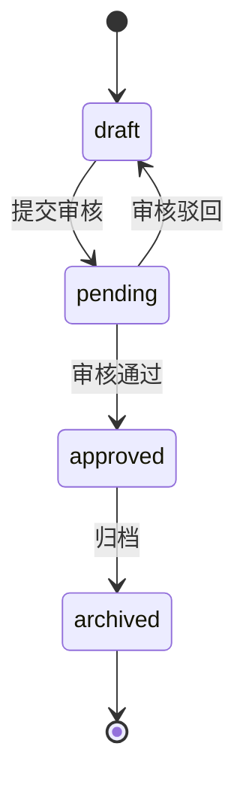
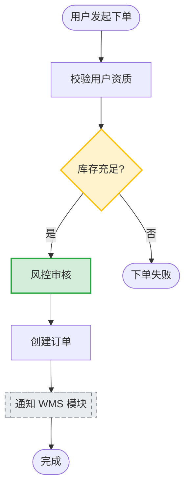
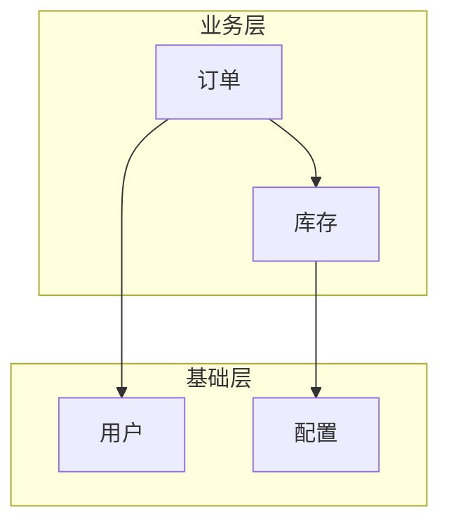

# Mermaid 图规范（eo-skills 统一约定）

本规范覆盖 eo-skills 体系内所有 mermaid 图的类型选择、样式约定、维护规则。

被以下 skill 引用：
- `eo-spec` / `eo-change` — 流程图、状态图
- `eo-module-init` — 模块架构图
- `eo-project-init` / `eo-project-update` — 项目级 ARCHITECTURE.md 依赖图
- `eo-archive` — 合并 change 流程图回 spec 时的 classDef 清理
- `eo-spec-review` / `eo-change-review` / `eo-review` — 一致性审查

## 1. 图类型选择矩阵

| 目标 | 图类型 | 用在哪 |
|------|--------|--------|
| 用户操作流程、业务决策分支 | `flowchart TD` | spec §3、change §2 |
| 多角色/多系统交互、时序敏感 | `sequenceDiagram` | spec §3、change §2（涉及跨模块调用） |
| 业务状态机、生命周期 | `stateDiagram-v2` | spec §3 |
| 模块内部组件关系 | `flowchart LR` | spec §1（模块架构图） |
| 项目级模块依赖拓扑 | `flowchart TB` | `eo-doc/ARCHITECTURE.md` |

**选型原则**：能用 `flowchart` 表达就不要上 `sequenceDiagram`；用户读图的认知成本低于语法表达力。

## 2. classDef 规范（change 流程图专用）

change.md 的流程图画的是**变更后的完整流程**，不是 diff。但要用 classDef 高亮这次 change 动了哪些节点，方便审查者一眼抓差异。

### 固定 classDef 定义

每张 change 流程图末尾必须包含这三行（无论有没有用到）：

```
classDef new fill:#d4edda,stroke:#28a745,stroke-width:2px
classDef changed fill:#fff3cd,stroke:#ffc107,stroke-width:2px
classDef extern fill:#e9ecef,stroke:#6c757d,stroke-dasharray:5 5
```

### 应用规则

| 场景 | 写法 |
|------|------|
| 本 change 新增的节点 | `NodeId:::new` |
| 本 change 修改了语义/行为的节点 | `NodeId:::changed` |
| 依赖的外部模块节点（非本模块内部） | `NodeId:::extern` |
| 本 change 删除的节点 | **不画在图里**，在图下方用 `> 移除：<原节点名> —— <原因>` 说明 |

### 合并回 spec 的规则

`eo-archive` 把 change 流程图合并回 spec.md 时：
- 保留图结构
- **删除所有 `:::new` / `:::changed` 标注**（spec 描述的是当前稳定态，不需要"谁改的"痕迹）
- 保留 `:::extern`（它描述的是"这是外部依赖"，在 spec 里依然有效）
- 保留 `classDef` 定义行（方便后续 change 复用）

## 3. 命名规则

- **节点 ID**：英文 kebab / camelCase，短（`validate-input`、`checkStock`），不要中文或空格
- **节点 label**：中文，简洁动词短语（`[验证输入]`、`{库存足够?}`）
- **决策节点**：菱形 `{...}`，label 末尾带 `?`
- **子图（subgraph）**：仅在一张图 ≥ 15 个节点时才用，用来分组

## 4. 最小示例

### 示例 A — spec §3 业务状态机



### 示例 B — change §2 业务流程图（带 Delta 高亮）



> 移除：原"人工审核"节点 —— 由新增的"风控审核"自动节点替代。

### 示例 C — 项目级模块依赖图



## 5. 审查清单（给 review 类 skill）

| 检查项 | 严重度 |
|--------|--------|
| spec/change 应画图但未画（符合触发规则） | P2 |
| 图与代码实现不一致（节点/分支/状态对不上） | P1 |
| change 流程图缺少 `:::new` / `:::changed` 标注（但明显有 Delta） | P2 |
| 节点 ID 含中文或空格（违反命名规则） | P3 |
| 图类型选错（如用 sequenceDiagram 画纯流程） | P3 |
| 归档后 spec 流程图残留 `:::new` / `:::changed` | P2 |

## 6. 什么时候可以不画

- 纯配置调整、纯文案/样式变更
- Delta 只有 1 条 ADDED 且不涉及流程分支
- bootstrap change 只是把 spec 已声明的能力落成代码，流程由 spec 图表达即可

其他情况默认要画。
