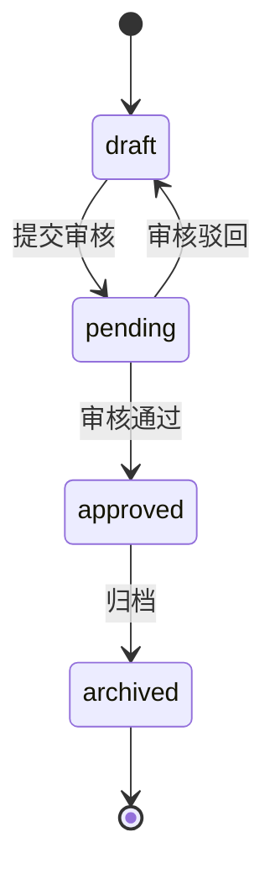
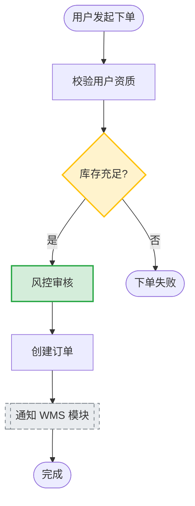
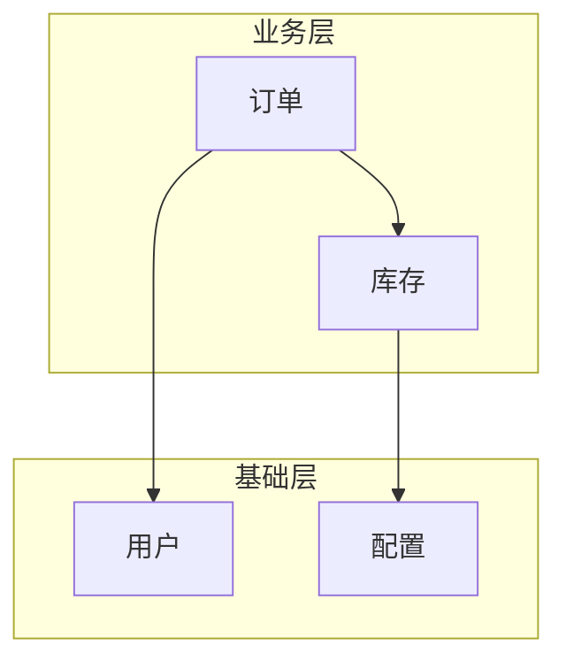

# Mermaid 图规范（eo-skills 统一约定）

本规范覆盖 eo-skills 体系内所有 mermaid 图的类型选择、样式约定、维护规则。

主要消费方：
- `eo-change` — 条件节 §6 流程图（画比说清楚时才画）
- `eo-recall` — 回忆问答的按需出图
- `eo-doc-manager` 自身 — state/ 中「当前稳定态」流程图的重画
- `eo-change-review` — change 含 §6 流程图时按本文件 §5 审查清单核对

## 1. 图类型选择矩阵

| 目标 | 图类型 | 用在哪 |
|------|--------|--------|
| 用户操作流程、业务决策分支 | `flowchart TD` | change §6、state/ 流程章节 |
| 多角色/多系统交互、时序敏感 | `sequenceDiagram` | change §6（涉及跨系统调用） |
| 业务状态机、生命周期 | `stateDiagram-v2` | change §6、state/ 规则章节 |
| 组件/依赖关系 | `flowchart LR/TB` | agent-handbook 依赖章节、recall 输出 |

**选型原则**：能用 `flowchart` 表达就不要上 `sequenceDiagram`；用户读图的认知成本低于语法表达力。

## 2. classDef 规范（change 流程图专用）

change.md 的流程图画的是**变更后的完整流程**，不是 diff。但要用 classDef 高亮这次 change 动了哪些节点，方便审查者一眼抓差异。

### 固定 classDef 定义

每张 change 流程图末尾必须包含这三行（无论有没有用到）：

```
classDef new fill:#d4edda,stroke:#28a745,stroke-width:2px
classDef changed fill:#fff3cd,stroke:#ffc107,stroke-width:2px
classDef extern fill:#e9ecef,stroke:#6c757d,stroke-dasharray:5 5
```

### 应用规则

| 场景 | 写法 |
|------|------|
| 本 change 新增的节点 | `NodeId:::new` |
| 本 change 修改了语义/行为的节点 | `NodeId:::changed` |
| 依赖的外部模块节点（非本模块内部） | `NodeId:::extern` |
| 本 change 删除的节点 | **不画在图里**，在图下方用 `> 移除：<原节点名> —— <原因>` 说明 |

### 归档后的去向

流程图随 change 目录一起归档冻结，**无任何合并动作**；`:::new` / `:::changed` 标注原样保留——它们是该次变更的历史痕迹。state/ 里若需要「当前稳定态」流程图，由 doc-manager sync 从代码推导重画（不带 Delta 标注）。

## 3. 命名规则

- **节点 ID**：英文 kebab / camelCase，短（`validate-input`、`checkStock`），不要中文或空格
- **节点 label**：中文，简洁动词短语（`[验证输入]`、`{库存足够?}`）
- **决策节点**：菱形 `{...}`，label 末尾带 `?`
- **子图（subgraph）**：仅在一张图 ≥ 15 个节点时才用，用来分组

## 4. 最小示例

### 示例 A — 业务状态机（示意：某审核流的领域状态）


```mermaid
stateDiagram-v2
    [*] --> draft
    draft --> pending: 提交审核
    pending --> approved: 审核通过
    pending --> draft: 审核驳回
    approved --> archived: 归档
    archived --> [*]
```

### 示例 B — change §6 流程图（带变更高亮）


```mermaid
flowchart TD
    Start([用户发起下单]) --> ValidateUser[校验用户资质]
    ValidateUser --> CheckStock{库存充足?}
    CheckStock -->|是| RiskCheck[风控审核]
    CheckStock -->|否| Fail([下单失败])
    RiskCheck --> CreateOrder[创建订单]
    CreateOrder --> NotifyWMS[[通知 WMS 模块]]
    NotifyWMS --> Done([完成])

    RiskCheck:::new
    CheckStock:::changed
    NotifyWMS:::extern

    classDef new fill:#d4edda,stroke:#28a745,stroke-width:2px
    classDef changed fill:#fff3cd,stroke:#ffc107,stroke-width:2px
    classDef extern fill:#e9ecef,stroke:#6c757d,stroke-dasharray:5 5
```

> 移除：原"人工审核"节点 —— 由新增的"风控审核"自动节点替代。

### 示例 C — 项目级模块依赖图


```mermaid
flowchart TB
    subgraph 业务层
        order[订单]
        inventory[库存]
    end
    subgraph 基础层
        user[用户]
        config[配置]
    end
    order --> inventory
    order --> user
    inventory --> config
```

## 5. 审查清单（给 review 类 skill）

| 检查项 | 严重度 |
|--------|--------|
| change 满足 §6 触发条件（状态机/多角色交互）却未画图 | P2 |
| 图与代码实现不一致（节点/分支/状态对不上） | P1 |
| change 流程图有明显变更点却缺 `:::new` / `:::changed` 标注 | P2 |
| 节点 ID 含中文或空格（违反命名规则） | P3 |
| 图类型选错（如用 sequenceDiagram 画纯流程） | P3 |
| state/ 的稳定态流程图残留 `:::new` / `:::changed`（重画时应清除） | P2 |

## 6. 什么时候可以不画

- 纯配置调整、纯文案/样式变更
- 单一能力点新增且不涉及流程分支
- 用文字一句能说清的线性流程

满足 change 模板 §6 触发条件（状态机、多角色交互等「画比说清楚」的场景）才画，其余默认不画。
