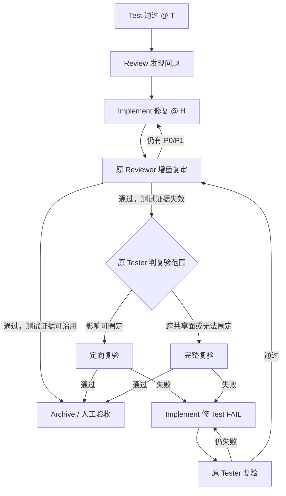

# 按测试影响路由 Review 修复

## 速览

- **改什么**：Review 反馈修复后不再机械重放完整 Test，而是先增量复审，再按既有测试证据是否失效分流。
- **为什么**：无功能影响的代码质量修复反复走 Test，会显著拉长 Implement → Test → Review 的收敛链路。
- **行为差异**：之前 Review 打回后容易固定重放 Implement → Test → Review；之后先走 Implement → 增量 Review，仅对失效的测试证据做定向或完整复验。
- **怎么验**：AC 5 条（人工 0 条）；用三类回路静态断言与归档门一致性测试验证。

## 1. 意图

初次 Test 已通过后进入 Review；如果 Review 发现问题，Implement 修复不应自动让整份测试报告失效。流程要回答的不是“代码改了多少”，而是“最近一次通过的测试证据是否仍能证明当前实现”。无运行时影响或影响已由轻量验证闭合的修复应直接增量复审；只有测试证据确实失效时才进入 Test，且影响可圈定时只做定向复验。

已钉决策：
- Review 来源的修复先回原 reviewer 增量复审；最后一个实施提交始终要有新鲜的 Review 结论。
- Implement 提供修复映射、同层验证与受影响 AC 候选，但不能自行批准跳过独立 Test。
- 原 reviewer 基于最近通过的 Test 基线 `T` 到当前实施基线 `H` 的完整差异，签署“沿用 / 复验”；Loop 只校验和消费该结论，不自行审代码猜测。
- 进入 Test 后，由原 tester 把复验分为“定向 / 完整”：影响能映射到有限 AC、用例及依赖闭包时定向复验；跨共享行为、测试基础设施或影响无法圈定时完整复验。
- 不新增状态或 frontmatter 字段；结构化判定落在最新 review/test 轮次，归档门校验其基线与处置结果。

## 2. 验收清单

- [ ] AC-1 当初次 Test 已通过、Review 反馈已修复且原 reviewer 证明既有测试证据可沿用时，eo-loop 走 `Review → Implement → Review`，不启动 eo-test；Implement 仍须完成缺陷同层验证与受影响 auto-light AC 重验。
- [ ] AC-2 当 Review 修复只使有限 AC、用例或依赖闭包的测试证据失效时，原 tester 只做定向复验，并记录“重跑范围 + 沿用范围”，不机械执行完整 Test。
- [ ] AC-3 当 Review 修复影响 auto-heavy AC、共享行为/契约、测试基础设施，或影响范围无法可靠圈定时，流程进入完整 eo-test；缺少处置结论、结论含糊或基线关系无法证明时按需要复验处理。
- [ ] AC-4 当修复来源是 Test FAIL 时，流程始终回原 tester 核销，不得套用 Review 修复的免测分支；测试通过后仍须让 Review 覆盖最后一个实施提交。
- [ ] AC-5 在已有历史 Test 的 Review 修复场景中，eo-archive 只在以下任一证据成立时放行：Test 已在当前实施基线通过；或锚定当前基线的最新 Review 明确签署较早 Test 证据可沿用。任何后续实施提交都会令 Review 结论与沿用签署同时过期；从未运行 eo-test 且没有待验 heavy AC 的既有放行路径保持不变。

## 3. TODO

### Batch 1（MVP）
- [x] TODO-1 定义 Review 修复后的非对称回路、证据沿用条件、角色权限和 fail-closed 规则。（文件：修改: eo-shared/conventions.md、eo-shared/acceptance.md；对应 AC-1、AC-3、AC-4、AC-5）
- [x] TODO-2 让 Implement 输出影响候选与局部验证证据，让原 Reviewer 在最新轮次独立签署测试证据处置及基线。（文件：修改: eo-implement/SKILL.md、eo-review/SKILL.md、eo-review/references/review-template.md；对应 AC-1、AC-3、AC-5）

### Batch 2
- [ ] TODO-3 让 Loop 按结构化处置路由，并让 Test 在需要复验时区分定向与完整范围、记录组合后的当前基线结论。（文件：修改: eo-loop/SKILL.md、eo-test/SKILL.md、eo-test/references/test-template.md；对应 AC-1、AC-2、AC-3、AC-4）
- [ ] TODO-4 收紧归档门：校验当前基线 Test，或校验由当前基线 Review 签署的旧 Test 证据沿用，拒绝缺失和过期证据。（文件：修改: eo-archive/SKILL.md；对应 AC-3、AC-5）
- [ ] TODO-5 增加跨文件静态回归，覆盖免完整重测、定向/完整复验、Test FAIL 强制回测及归档门新鲜度。（文件：新增: tests/test_loop_retest_routing_caliber.py；对应 AC-1、AC-2、AC-3、AC-4、AC-5）

## 6. 流程图

